# Wine Quality Prediction and Wine Type Prediction

**Introduction**

The study aims to explore the potential of using various wine
ingredients and compounds to predict wine quality and type. By examining
multiple input variables, regression models can forecast wine quality or
type. The objective of the model is to assist winemakers in identifying
wine quality based on wine quality and detecting the wine type from wine
compounds. The results of our study will provide valuable insights to
improve production processes and help winemakers produce high-quality
wines more efficiently.

The dataset used in this study is from the publicly available dataset
“Wine Quality Data” on Kaggle. It consists of 32485 observation and 14
variables. The quality unit is selected as our continous response value.
We did not include ID, since we are not considering each wine as
individual subjects for a mixed model. Among our independent variables,
we have 1 categorical factors: Type (Red Wine and White Wine). The
quality range of our data set is between 3 to 8 with a normal
distribution (with gap).

<https://www.kaggle.com/datasets/subhajournal/wine-quality-data-combined?datasetId=3527385>

To optimize the predictive power of our model we used a multiple linear
regression with Quality as our response. We applied the following
methods and techniques:

-   Multiple linear regression

-   Dummy variables

-   Logarithmic Transformations

-   Residual diagnostics

-   Outlier diagnostics

-   Model selection

-   Interaction

-   Polynomial regression

------------------------------------------------------------------------

# Wine Quality Prediction

### Load the library

The packages needed to facilitate the statistical analysis of our data
are below.

``` r
library(readr)
library(lmtest)
library(car)
library(boot)
library(MASS)
```

### Data Preparation

We clean and modify the data, we noticed that we need to convert `Type`
to factor variables.

``` r
wine_data = read_csv("WineQuality.csv")
str(wine_data)
```

    ## spc_tbl_ [32,485 × 14] (S3: spec_tbl_df/tbl_df/tbl/data.frame)
    ##  $ ...1                : num [1:32485] 2732 2607 1653 3264 4931 ...
    ##  $ fixed acidity       : num [1:32485] 7.4 5.3 4.7 6.9 6.4 8.4 7.4 7 6.7 6.4 ...
    ##  $ volatile acidity    : num [1:32485] 0.17 0.31 0.145 0.26 0.45 0.32 0.3 0.32 0.46 0.25 ...
    ##  $ citric acid         : num [1:32485] 0.29 0.38 0.29 0.29 0.07 0.35 0.22 0.29 0.27 0.3 ...
    ##  $ residual sugar      : num [1:32485] 1.4 10.5 1 4.2 1.1 11.7 5.25 7.6 5.2 5.5 ...
    ##  $ chlorides           : num [1:32485] 0.047 0.031 0.042 0.043 0.03 0.029 0.053 0.025 0.039 0.038 ...
    ##  $ free sulfur dioxide : num [1:32485] 23 53 35 33 10 3 33 35 35 15 ...
    ##  $ total sulfur dioxide: num [1:32485] 107 140 90 114 131 46 180 124 96 129 ...
    ##  $ density             : num [1:32485] 0.994 0.993 0.991 0.99 0.991 ...
    ##  $ pH                  : num [1:32485] 3.52 3.34 3.76 3.16 2.97 3.02 3.13 3.15 3.16 3.14 ...
    ##  $ sulphates           : num [1:32485] 0.65 0.46 0.49 0.31 0.28 0.34 0.45 0.65 0.44 0.49 ...
    ##  $ alcohol             : num [1:32485] 10.4 11.7 11.3 12.5 10.8 11.8 11.6 12.8 12.4 9.6 ...
    ##  $ quality             : num [1:32485] 6 6 6 6 5 6 6 7 7 6 ...
    ##  $ Type                : chr [1:32485] "White Wine" "White Wine" "White Wine" "White Wine" ...
    ##  - attr(*, "spec")=
    ##   .. cols(
    ##   ..   ...1 = col_double(),
    ##   ..   `fixed acidity` = col_double(),
    ##   ..   `volatile acidity` = col_double(),
    ##   ..   `citric acid` = col_double(),
    ##   ..   `residual sugar` = col_double(),
    ##   ..   chlorides = col_double(),
    ##   ..   `free sulfur dioxide` = col_double(),
    ##   ..   `total sulfur dioxide` = col_double(),
    ##   ..   density = col_double(),
    ##   ..   pH = col_double(),
    ##   ..   sulphates = col_double(),
    ##   ..   alcohol = col_double(),
    ##   ..   quality = col_double(),
    ##   ..   Type = col_character()
    ##   .. )
    ##  - attr(*, "problems")=<externalptr>

``` r
#View(wine_data)

# remove the id 
wine_data = subset(wine_data, select = -c(1))

wine_data$Type = as.factor(wine_data$Type)

levels(wine_data$Type)
```

    ## [1] "Red Wine"   "White Wine"

We do some quick checks of correlation between the predictors.
Correlation measures strength and direction of the linear relationship
between two variables. The results shows most of data are not highly
correlated.

``` r
pairs(subset(wine_data, select = -c(Type, quality)), col = "dodgerblue")
```

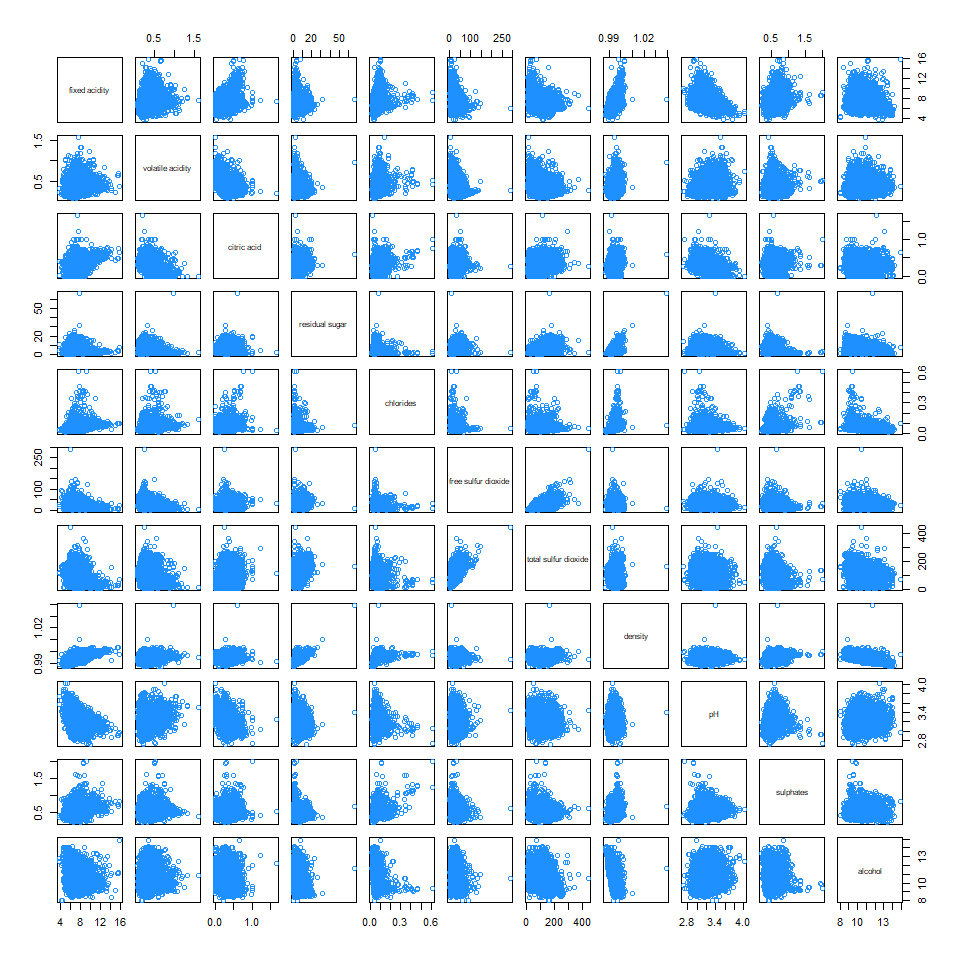

``` r
round(cor(subset(wine_data, select = -c(Type, quality))), 2)
```

    ##                      fixed acidity volatile acidity citric acid residual sugar
    ## fixed acidity                 1.00             0.22        0.32          -0.11
    ## volatile acidity              0.22             1.00       -0.38          -0.20
    ## citric acid                   0.32            -0.38        1.00           0.15
    ## residual sugar               -0.11            -0.20        0.15           1.00
    ## chlorides                     0.30             0.39        0.03          -0.13
    ## free sulfur dioxide          -0.28            -0.36        0.14           0.41
    ## total sulfur dioxide         -0.33            -0.43        0.20           0.50
    ## density                       0.46             0.27        0.10           0.55
    ## pH                           -0.26             0.26       -0.33          -0.26
    ## sulphates                     0.30             0.23        0.05          -0.19
    ## alcohol                      -0.10            -0.04       -0.01          -0.36
    ##                      chlorides free sulfur dioxide total sulfur dioxide density
    ## fixed acidity             0.30               -0.28                -0.33    0.46
    ## volatile acidity          0.39               -0.36                -0.43    0.27
    ## citric acid               0.03                0.14                 0.20    0.10
    ## residual sugar           -0.13                0.41                 0.50    0.55
    ## chlorides                 1.00               -0.20                -0.29    0.37
    ## free sulfur dioxide      -0.20                1.00                 0.72    0.02
    ## total sulfur dioxide     -0.29                0.72                 1.00    0.03
    ## density                   0.37                0.02                 0.03    1.00
    ## pH                        0.05               -0.14                -0.24    0.01
    ## sulphates                 0.39               -0.19                -0.28    0.26
    ## alcohol                  -0.26               -0.17                -0.26   -0.68
    ##                         pH sulphates alcohol
    ## fixed acidity        -0.26      0.30   -0.10
    ## volatile acidity      0.26      0.23   -0.04
    ## citric acid          -0.33      0.05   -0.01
    ## residual sugar       -0.26     -0.19   -0.36
    ## chlorides             0.05      0.39   -0.26
    ## free sulfur dioxide  -0.14     -0.19   -0.17
    ## total sulfur dioxide -0.24     -0.28   -0.26
    ## density               0.01      0.26   -0.68
    ## pH                    1.00      0.20    0.13
    ## sulphates             0.20      1.00    0.00
    ## alcohol               0.13      0.00    1.00

We plot the histogram of the data, and look at the distribution of the
data.

``` r
par(mfrow = c(5, 3))
hist(wine_data$`fixed acidity`,
xlab = "fixed acidity",
main = "Distribution of fixed acidity",
breaks = 12,
col = "dodgerblue",
border = "darkorange")

hist(wine_data$`volatile acidity`,
xlab = "volatile acidity",
main = "Distribution of volatile acidity",
breaks = 12,
col = "dodgerblue",
border = "darkorange")

hist(wine_data$`citric acid`,
xlab = "citric acid",
main = "Distribution of citric acid",
breaks = 12,
col = "dodgerblue",
border = "darkorange")

hist(wine_data$`residual sugar`,
xlab = "residual sugar",
main = "Distribution of residual sugar",
breaks = 12,
col = "dodgerblue",
border = "darkorange")

hist(wine_data$chlorides,
xlab = "chlorides",
main = "Distribution of chlorides",
breaks = 12,
col = "dodgerblue",
border = "darkorange")
 
hist(wine_data$`free sulfur dioxide`,
xlab = "free sulfur dioxide",
main = "Distribution of free sulfur dioxide",
breaks = 12,
col = "dodgerblue",
border = "darkorange")


hist(wine_data$`total sulfur dioxide`,
xlab = "total sulfur dioxide",
main = "Distribution of total sulfur dioxide",
breaks = 12,
col = "dodgerblue",
border = "darkorange")


hist(wine_data$density,
xlab = "density",
main = "Distribution of density",
breaks = 12,
col = "dodgerblue",
border = "darkorange")


hist(wine_data$pH,
xlab = "pH",
main = "Distribution of pH",
breaks = 12,
col = "dodgerblue",
border = "darkorange")


hist(wine_data$sulphates,
xlab = "sulphates",
main = "Distribution of sulphates",
breaks = 12,
col = "dodgerblue",
border = "darkorange")
  

hist(wine_data$alcohol,
xlab = "alcohol",
main = "Distribution of alcohol",
breaks = 12,
col = "dodgerblue",
border = "darkorange")


hist(as.numeric(wine_data$quality),
xlab = "Wine Quality",
main = "Distribution of Wine Quality",
breaks = 12,
col = "dodgerblue",
border = "darkorange")


barplot(table(wine_data$Type),
xlab = "Wine Type",
ylab = "Frequency",
main = "Distribution of Type",
col = "dodgerblue",
border = "darkorange")
```

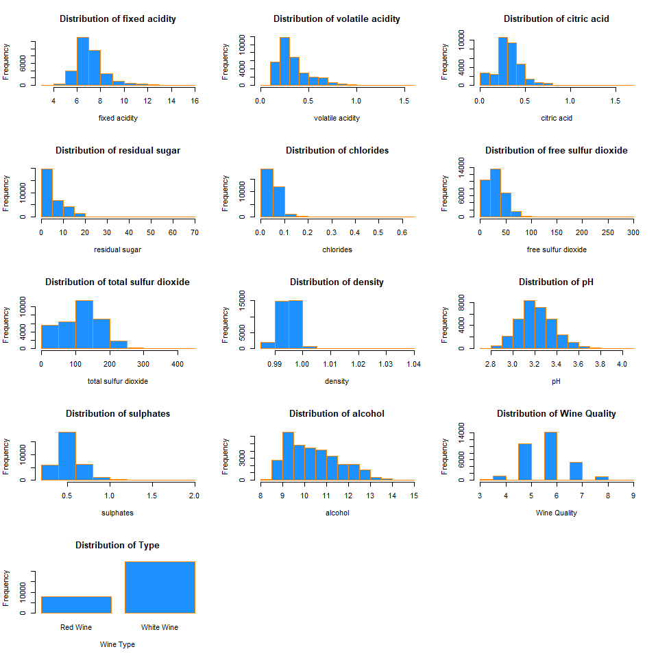

-   Wine Quality

One thing we notice here, it’s the distribution of Wine Quality, It’s
seems follow the normal distribution but with gap in it. The reason of
this, it’s because wine were rated in integer without fractions.

**Methods**

We defined the functions that would facilitate the statistical analysis
of our data and the different models we fitted.

``` r
plot_fitted_resid = function(model, pointcol = "dodgerblue", linecol = "darkorange") {
  plot(fitted(model), resid(model), 
       col = pointcol, pch = 20, cex = 1.5,
       xlab = "Fitted", ylab = "Residuals", main = "Fitted vs Residuals")
  abline(h = 0, col = linecol, lwd = 2)
}

plot_qq = function(model, pointcol = "dodgerblue", linecol = "darkorange") {
  qqnorm(resid(model), col = pointcol, pch = 20, cex = 1.5)
  qqline(resid(model), col = linecol, lwd = 2)
}


calc_bp_decision = function(model, alpha) {
  decide = unname(bptest(model)$p.value < alpha)
  ifelse(decide, "Reject", "Fail to Reject")
}

calc_sw_decision = function(model, alpha) {
  decide = unname(shapiro.test(resid(model))$p.value < alpha)
  ifelse(decide, "Reject", "Fail to Reject")
}

calc_loocv_rmse = function(model) {
  sqrt(mean((resid(model) / (1 - hatvalues(model))) ^ 2))
}

calc_adj_r2 = function(model) {
  summary(model)$adj.r.squared
}

make_conf_mat = function(predicted, actual) {
table(predicted = predicted, actual = actual)
}

get_sens = function(conf_mat) {
conf_mat[2, 2] / sum(conf_mat[, 2])
}

get_spec = function(conf_mat) {
conf_mat[1, 1] / sum(conf_mat[, 1])
}
```

We split data into a training set (16243) and testing set (16242).

``` r
set.seed(9)
#wine_data = subset(wine_data, select = -c(1))
wine_idx = sample(nrow(wine_data),size = trunc(0.50 * nrow(wine_data)))
wine_trn = wine_data[-wine_idx, ]
wine_tst = wine_data[wine_idx, ]
```

# Variable Selection, Model Building and Model Diagnostics

A Step-by-step decision making process throughout the analysis.

### Additive Model

Using the dataset, an additive model with quality as a response and all
other variables is fit using linear regression.

``` r
wine_all = lm(quality ~ ., data = wine_trn)
calc_loocv_rmse(wine_all)
```

    ## [1] 0.7333

``` r
calc_adj_r2(wine_all)
```

    ## [1] 0.2941

We check the Adjusted R-Squared *R*<sup>2</sup> and LOOCV-RMSE of this
model.

``` r
par(mfrow = c(1, 2))
plot_fitted_resid(wine_all)
plot_qq(wine_all) 
```

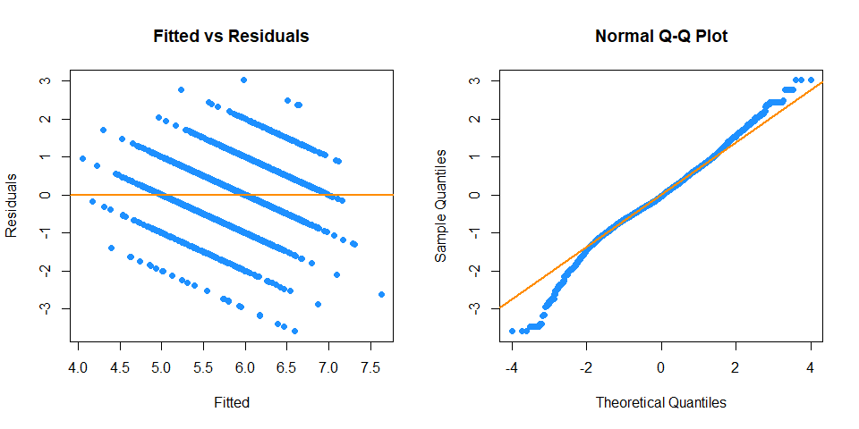

On the fitted versus residuals plot, we see two things very clearly. For
any fitted value, the residuals seem roughly centered at 0. This is
good! The linearity assumption is not violated. However, we also see
very clearly, the spread of the residuals is off. This is bad! The
constant variance assumption is probably violated here..

In Q-Q plots, the points of the plot do not closely follow a straight
line, this would suggest that the data probably not come from a normal
distribution (theoretical quantiles).

We use the Breusch-Pagan Test to verify the constant variance
assumption.

``` r
calc_bp_decision(wine_all, alpha = 0.01)
```

    ## [1] "Reject"

We reject the null of homoscedasticity. The constant variance assumption
is violated. This matches our findings with a fitted versus residuals
plot.

### Response transformation : Box-Cox Transformations

We then use the boxcox() function to find the best transformation of the
form considered by the Box-Cox method.

``` r
boxcox(wine_all, plotit = TRUE, lambda = seq(0.45, 1, by = 0.05))
```

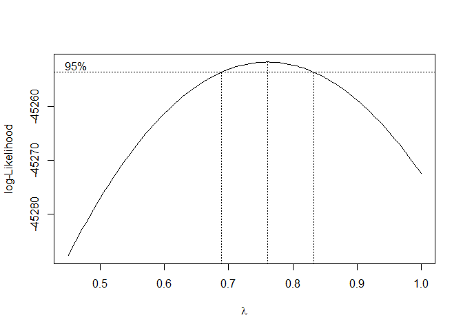

Using the Box-Cox method, we see that *λ* = 0.76 = 0.76 is both in the
confidence interval, and is extremely close to the maximum, which
suggests a transformation of the form

$$
\frac{y^\lambda - 1}{\lambda} = \frac{y^{0.76} - 1}{0.76}.
$$

We then fit a model with this transformation applied to the response.

``` r
wine_all_cox = lm((((quality ^ 0.76) - 1) / 0.76) ~ ., data = wine_trn)
calc_loocv_rmse(wine_all_cox)
```

    ## [1] 0.4813

``` r
calc_adj_r2(wine_all_cox)
```

    ## [1] 0.2929

``` r
par(mfrow = c(1, 2))
plot_fitted_resid(wine_all_cox)
plot_qq(wine_all_cox)
```

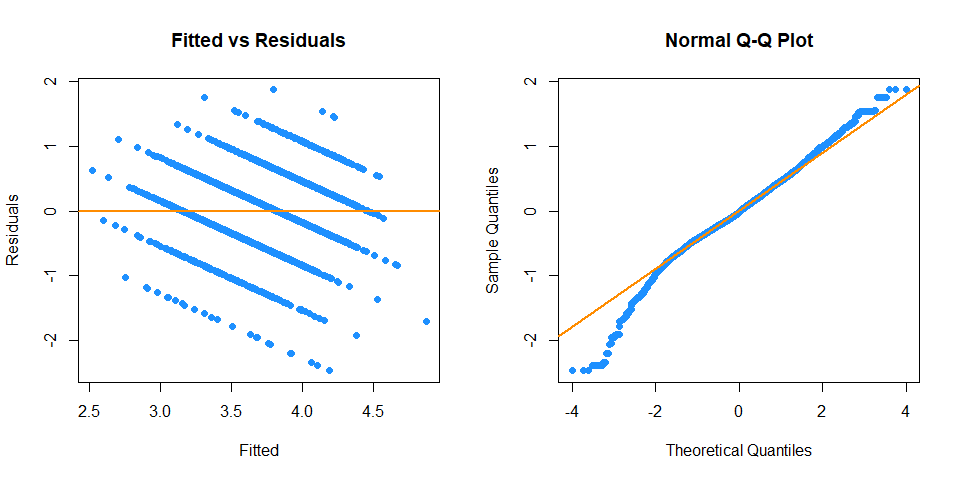

### Collinearity

We investigate how the presence of collinearity actually affects the
model. The variance inflation factor quantifies the effect of
collinearity on the variance of our regression estimates.

``` r
vif(wine_all_cox)
```

    ##        `fixed acidity`     `volatile acidity`          `citric acid` 
    ##                  4.840                  2.234                  1.616 
    ##       `residual sugar`              chlorides  `free sulfur dioxide` 
    ##                  9.371                  1.681                  2.245 
    ## `total sulfur dioxide`                density                     pH 
    ##                  4.022                 20.565                  2.516 
    ##              sulphates                alcohol                   Type 
    ##                  1.547                  5.020                  6.992

In practice it is common to say that any VIF greater than 5 is cause for
concern. So in this case, we see there is a multicollinearity issue as
some of the predictors have a VIF greater than 5.

### Small Additive Model

Based on collinearity matrix result, we remove the predictor
`residual sugar`, `density` and `Type` for a smaller model. Since the
variable `alcohol` vif is fairly close to 5, we decided to keep the
`alcohol`.

``` r
wine_sml = lm((((quality ^ 0.76) - 1) / 0.76) ~ `fixed acidity` + `volatile acidity` + `citric acid` +  chlorides + `free sulfur dioxide` + `total sulfur dioxide`+ pH + sulphates + alcohol, data = wine_trn)
calc_loocv_rmse(wine_sml)
```

    ## [1] 0.4879

``` r
calc_adj_r2(wine_sml)
```

    ## [1] 0.2732

``` r
par(mfrow = c(1, 2))
plot_fitted_resid(wine_sml)
plot_qq(wine_sml) 
```

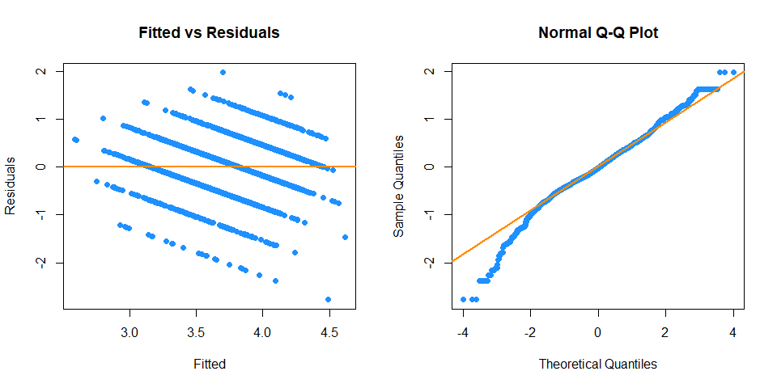

We check how many observations have “high” leverage. A common heuristic
would be to compare each leverage to two times the average leverage. A
leverage larger than this is considered an observation to be aware of.

``` r
sum(hatvalues(wine_sml) > 2 * mean(hatvalues(wine_sml)))
```

    ## [1] 975

We check how many observations have a standardized residual less than 2
in magnitude.

``` r
sum(abs(rstandard(wine_sml)) > 2)
```

    ## [1] 910

We check how many influential points.

A common measure of influence is **Cook’s Distance**, A Cook’s Distance
is often considered large if

$$
D_i \> \frac{4}{n}
$$

and an observation with a large Cook’s Distance is called influential.
This is again simply a heuristic, and not an exact rule.

``` r
cd_wine = cooks.distance(wine_sml)
sum(cd_wine > 4 / length(cd_wine))
```

    ## [1] 862

We decided to remove these influential points and fit the sml model
again.

``` r
wine_sml_fix = lm((((quality ^ 0.76) - 1) / 0.76) ~ `fixed acidity` + `volatile acidity` + `citric acid` +  chlorides + `free sulfur dioxide` + `total sulfur dioxide`+ pH + sulphates + alcohol, data = wine_trn, subset = cd_wine <= 4 / length(cd_wine))

coef(wine_sml_fix)
```

    ##            (Intercept)        `fixed acidity`     `volatile acidity` 
    ##               1.250106               0.001601              -0.869532 
    ##          `citric acid`              chlorides  `free sulfur dioxide` 
    ##              -0.045832              -1.014413               0.005348 
    ## `total sulfur dioxide`                     pH              sulphates 
    ##              -0.001402               0.129716               0.460074 
    ##                alcohol 
    ##               0.203861

``` r
calc_loocv_rmse(wine_sml_fix)
```

    ## [1] 0.4166

``` r
calc_adj_r2(wine_sml_fix)
```

    ## [1] 0.3496

``` r
par(mfrow = c(1, 2))
plot_fitted_resid(wine_sml_fix)
plot_qq(wine_sml_fix) 
```


We see that the adjusted r-squared increased, the LOOCV-RMSE test change
significantly and the Q-Q plot improved, such that normality of the data
is no longer suspect. We also see that the outlier point was removed
from the Fitted vs Residuals plot allowing us to better see the
linearity of the data (Fitted vs Residuals plot centered around 0).

### BIC Backward Model Selection

Using the small additive model, we perform a backwards step BIC model
selection. Backward selection procedures start with all possible
predictors in the model, then consider how deleting a single predictor
will affect a chosen metric.

``` r
wine_back_bic = step(wine_sml_fix, direction = "backward", k = log(length(resid(wine_sml))), trace = 0)

names(coef(wine_back_bic))
```

    ## [1] "(Intercept)"            "`volatile acidity`"     "chlorides"             
    ## [4] "`free sulfur dioxide`"  "`total sulfur dioxide`" "pH"                    
    ## [7] "sulphates"              "alcohol"

``` r
calc_loocv_rmse(wine_back_bic)
```

    ## [1] 0.4166

``` r
calc_adj_r2(wine_back_bic)
```

    ## [1] 0.3496

``` r
calc_bp_decision(wine_back_bic, alpha = 0.01)
```

    ## [1] "Reject"

``` r
par(mfrow = c(1, 2))
plot_fitted_resid(wine_back_bic)
plot_qq(wine_back_bic) 
```

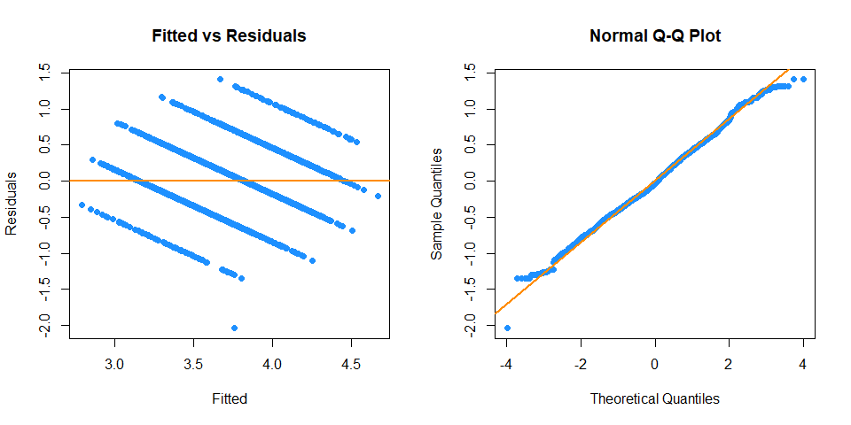

Using the chosen model from BIC backwards step model selection, we see
that the result did not change much while the number of model predictors
was lower than the small additive model.

### Predictor Transformation : log transformation

Since both `free sulfur dioxide` and `total sulfur dioxide` are between
0 and 1. we decided to use log transformation on the predictor variable
`free sulfur dioxide` and `total sulfur dioxide`

``` r
wine_log = lm((((quality ^ 0.76) - 1) / 0.76) ~ `volatile acidity` +  chlorides + log(`free sulfur dioxide`) + log(`total sulfur dioxide`) + pH + sulphates + alcohol, data = wine_trn)

calc_loocv_rmse(wine_log)
```

    ## [1] 0.4815

``` r
calc_adj_r2(wine_log)
```

    ## [1] 0.2916

``` r
par(mfrow = c(1, 2))
plot_fitted_resid(wine_log)
plot_qq(wine_log) 
```

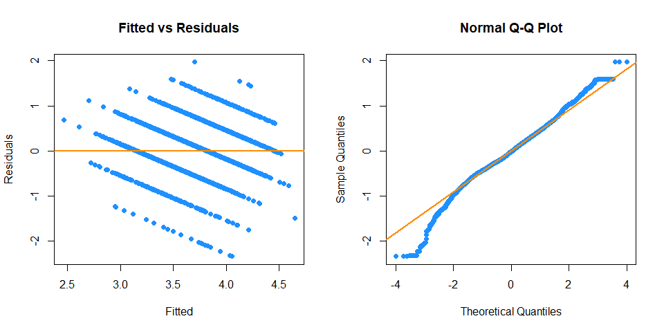

``` r
cd_wine = cooks.distance(wine_log)
sum(cd_wine > 4 / length(cd_wine))
```

    ## [1] 927

We find `sum(cd_wine > 4 / length(cd_wine))` influential points We
remove the influential points and fit the model again.

``` r
wine_log_fix = lm((((quality ^ 0.76) - 1) / 0.76) ~ `volatile acidity` +  chlorides + log(`free sulfur dioxide`) + log(`total sulfur dioxide`) + pH + sulphates + alcohol, data = wine_trn, subset = cd_wine <= 4 / length(cd_wine))


calc_loocv_rmse(wine_log_fix)
```

    ## [1] 0.4103

``` r
calc_adj_r2(wine_log_fix)
```

    ## [1] 0.3701

``` r
par(mfrow = c(1, 2))
plot_fitted_resid(wine_log_fix)
plot_qq(wine_log_fix) 
```

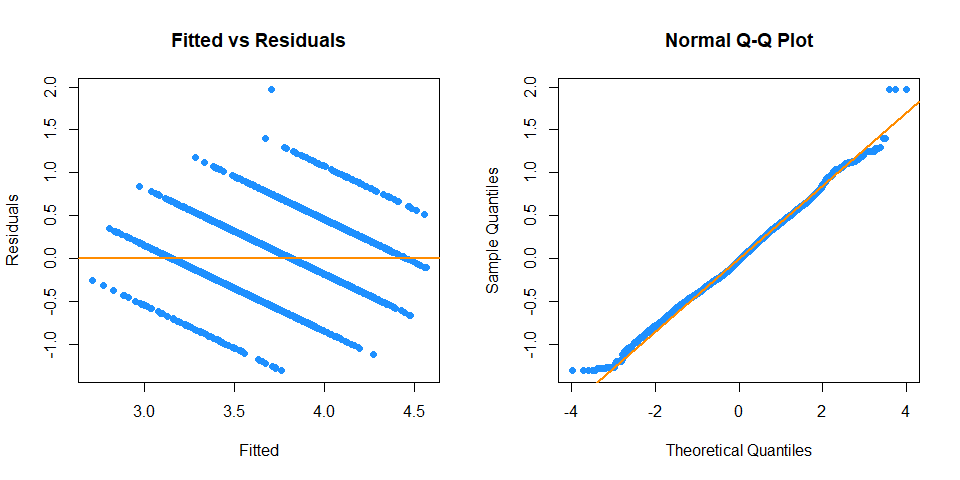

### Interaction terms

We also consider all possible two-way interactions.

``` r
wine_two = lm((((quality ^ 0.76) - 1) / 0.76) ~ (`volatile acidity` + chlorides + `free sulfur dioxide` + `total sulfur dioxide` + pH + sulphates + alcohol) ^ 2 + + I(`volatile acidity` ^ 2) + I(`free sulfur dioxide` ^ 2) + I(`total sulfur dioxide` ^ 2) + I(pH ^ 2) + I(sulphates ^ 2) + I(alcohol ^ 2), data = wine_trn)


calc_loocv_rmse(wine_two)
```

    ## [1] 0.4723

``` r
calc_adj_r2(wine_two)
```

    ## [1] 0.322

``` r
par(mfrow = c(1, 2))
plot_fitted_resid(wine_two)
plot_qq(wine_two) 
```

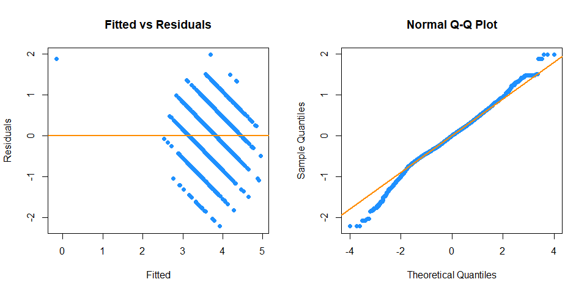

### BIC Backward Model Selection

We perform the BIC backwards step model selection to find a smaller,
more reasonable model.

``` r
wine_back_bic2 = step(wine_two, direction = "backward", k = log(length(resid(wine_two))), trace = 0)

names(coef(wine_back_bic2))
```

    ##  [1] "(Intercept)"                             
    ##  [2] "`volatile acidity`"                      
    ##  [3] "chlorides"                               
    ##  [4] "`free sulfur dioxide`"                   
    ##  [5] "`total sulfur dioxide`"                  
    ##  [6] "pH"                                      
    ##  [7] "sulphates"                               
    ##  [8] "alcohol"                                 
    ##  [9] "I(`volatile acidity`^2)"                 
    ## [10] "I(`free sulfur dioxide`^2)"              
    ## [11] "I(pH^2)"                                 
    ## [12] "I(alcohol^2)"                            
    ## [13] "`volatile acidity`:chlorides"            
    ## [14] "`volatile acidity`:`free sulfur dioxide`"
    ## [15] "`volatile acidity`:alcohol"              
    ## [16] "chlorides:`total sulfur dioxide`"        
    ## [17] "chlorides:pH"                            
    ## [18] "chlorides:sulphates"                     
    ## [19] "chlorides:alcohol"                       
    ## [20] "`free sulfur dioxide`:pH"                
    ## [21] "`free sulfur dioxide`:sulphates"         
    ## [22] "`free sulfur dioxide`:alcohol"           
    ## [23] "`total sulfur dioxide`:pH"               
    ## [24] "`total sulfur dioxide`:sulphates"        
    ## [25] "pH:alcohol"

``` r
calc_loocv_rmse(wine_back_bic2)
```

    ## [1] 0.4721

``` r
calc_adj_r2(wine_back_bic2)
```

    ## [1] 0.3216

``` r
cd_wine = cooks.distance(wine_back_bic2)
sum(cd_wine > 4 / length(cd_wine))
```

    ## [1] 763

We find `sum(cd_wine > 4 / length(cd_wine))` influential points We
remove the influential points and fit the model again.

``` r
wine_two_fix = lm((((quality ^ 0.76) - 1) / 0.76) ~ `volatile acidity` + chlorides + `free sulfur dioxide` + `total sulfur dioxide` + pH + sulphates + alcohol + I(`volatile acidity`^2) + I(`free sulfur dioxide`^2) + I(pH^2) + I(alcohol^2) + `volatile acidity`:chlorides + `volatile acidity`:`free sulfur dioxide` + `volatile acidity`:alcohol + chlorides:`total sulfur dioxide`+ chlorides:pH + chlorides:sulphates + chlorides:alcohol + `free sulfur dioxide`:pH + `free sulfur dioxide`:sulphates + `free sulfur dioxide`:alcohol + `total sulfur dioxide`:pH + `total sulfur dioxide`:sulphates + pH:alcohol, data = wine_trn, subset = cd_wine <= 4 / length(cd_wine))


calc_loocv_rmse(wine_two_fix)
```

    ## [1] 0.418

``` r
calc_adj_r2(wine_two_fix)
```

    ## [1] 0.3815

``` r
par(mfrow = c(1, 2))
plot_fitted_resid(wine_two_fix)
plot_qq(wine_two_fix) 
```

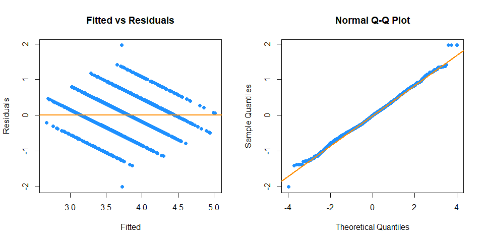

### Big Model

We add the log(`free sulfur dioxide`) + log(`total sulfur dioxide`) to
the two-way Interaction selected model.

``` r
wine_big = lm((((quality ^ 0.76) - 1) / 0.76) ~ log(`free sulfur dioxide`) + log(`total sulfur dioxide`) +  `volatile acidity` + chlorides + `free sulfur dioxide` + `total sulfur dioxide` + pH + sulphates + alcohol + I(`volatile acidity`^2) + I(`free sulfur dioxide`^2) + I(pH^2) + I(alcohol^2) + `volatile acidity`:chlorides + `volatile acidity`:`free sulfur dioxide` + `volatile acidity`:alcohol + chlorides:`total sulfur dioxide`+ chlorides:pH + chlorides:sulphates + chlorides:alcohol + `free sulfur dioxide`:pH + `free sulfur dioxide`:sulphates + `free sulfur dioxide`:alcohol + `total sulfur dioxide`:pH + `total sulfur dioxide`:sulphates + pH:alcohol, data = wine_trn)


calc_loocv_rmse(wine_big)
```

    ## [1] 0.4678

``` r
calc_adj_r2(wine_big)
```

    ## [1] 0.3329

``` r
par(mfrow = c(1, 2))
plot_fitted_resid(wine_big)
plot_qq(wine_big) 
```

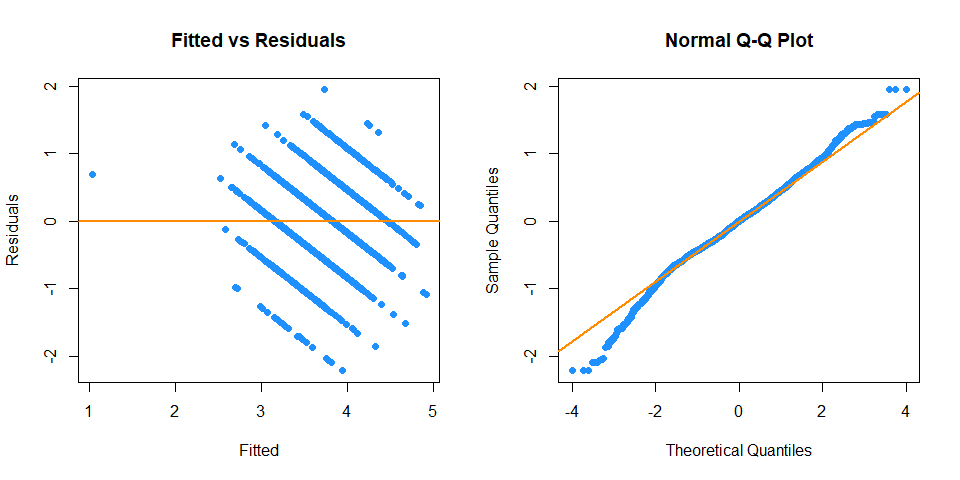

``` r
cd_wine = cooks.distance(wine_big)
sum(cd_wine > 4 / length(cd_wine))
```

    ## [1] 813

We find `sum(cd_wine > 4 / length(cd_wine))` influential points We
remove the influential points and fit the model again.

``` r
wine_big_fix = lm((((quality ^ 0.76) - 1) / 0.76) ~ `volatile acidity` + chlorides + `free sulfur dioxide` + `total sulfur dioxide` + pH + sulphates + alcohol + I(`volatile acidity`^2) + I(`free sulfur dioxide`^2) + I(pH^2) + I(alcohol^2) + `volatile acidity`:chlorides + `volatile acidity`:`free sulfur dioxide` + `volatile acidity`:alcohol + chlorides:`total sulfur dioxide`+ chlorides:pH + chlorides:sulphates + chlorides:alcohol + `free sulfur dioxide`:pH + `free sulfur dioxide`:sulphates + `free sulfur dioxide`:alcohol + `total sulfur dioxide`:pH + `total sulfur dioxide`:sulphates + pH:alcohol, data = wine_trn, subset = cd_wine <= 4 / length(cd_wine))


calc_loocv_rmse(wine_big_fix)
```

    ## [1] 0.4162

``` r
calc_adj_r2(wine_big_fix)
```

    ## [1] 0.3829

``` r
par(mfrow = c(1, 2))
plot_fitted_resid(wine_big_fix)
plot_qq(wine_big_fix) 
```

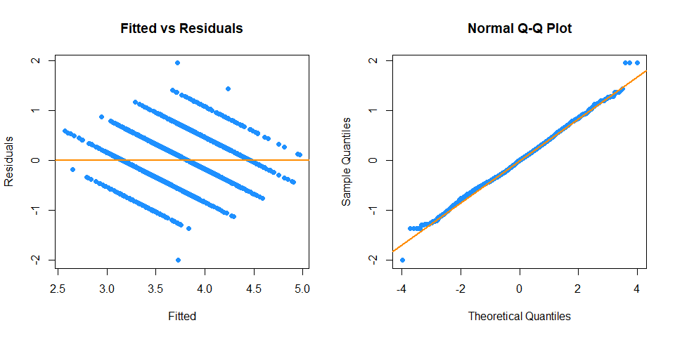

### Anova Test

We perform the anova test to compare the samlpe additive model and
two-way interaction selected model.

``` r
anova(wine_sml, wine_back_bic2)
```

    ## Analysis of Variance Table
    ## 
    ## Model 1: (((quality^0.76) - 1)/0.76) ~ `fixed acidity` + `volatile acidity` + 
    ##     `citric acid` + chlorides + `free sulfur dioxide` + `total sulfur dioxide` + 
    ##     pH + sulphates + alcohol
    ## Model 2: (((quality^0.76) - 1)/0.76) ~ `volatile acidity` + chlorides + 
    ##     `free sulfur dioxide` + `total sulfur dioxide` + pH + sulphates + 
    ##     alcohol + I(`volatile acidity`^2) + I(`free sulfur dioxide`^2) + 
    ##     I(pH^2) + I(alcohol^2) + `volatile acidity`:chlorides + `volatile acidity`:`free sulfur dioxide` + 
    ##     `volatile acidity`:alcohol + chlorides:`total sulfur dioxide` + 
    ##     chlorides:pH + chlorides:sulphates + chlorides:alcohol + 
    ##     `free sulfur dioxide`:pH + `free sulfur dioxide`:sulphates + 
    ##     `free sulfur dioxide`:alcohol + `total sulfur dioxide`:pH + 
    ##     `total sulfur dioxide`:sulphates + pH:alcohol
    ##   Res.Df  RSS Df Sum of Sq    F Pr(>F)    
    ## 1  16233 3860                             
    ## 2  16218 3599 15       261 78.3 <2e-16 ***
    ## ---
    ## Signif. codes:  0 '***' 0.001 '**' 0.01 '*' 0.05 '.' 0.1 ' ' 1

``` r
anova(wine_sml, wine_back_bic2)[2, "Pr(>F)"]
```

    ## [1] 2.356e-232

The p-value is extremely low, so we would reject the null hypothesis.
Between the two, we choose the two-way interaction model.

We perform the anova test to compare two-way interaction selected model
and the big model.

``` r
anova(wine_back_bic2, wine_big)
```

    ## Analysis of Variance Table
    ## 
    ## Model 1: (((quality^0.76) - 1)/0.76) ~ `volatile acidity` + chlorides + 
    ##     `free sulfur dioxide` + `total sulfur dioxide` + pH + sulphates + 
    ##     alcohol + I(`volatile acidity`^2) + I(`free sulfur dioxide`^2) + 
    ##     I(pH^2) + I(alcohol^2) + `volatile acidity`:chlorides + `volatile acidity`:`free sulfur dioxide` + 
    ##     `volatile acidity`:alcohol + chlorides:`total sulfur dioxide` + 
    ##     chlorides:pH + chlorides:sulphates + chlorides:alcohol + 
    ##     `free sulfur dioxide`:pH + `free sulfur dioxide`:sulphates + 
    ##     `free sulfur dioxide`:alcohol + `total sulfur dioxide`:pH + 
    ##     `total sulfur dioxide`:sulphates + pH:alcohol
    ## Model 2: (((quality^0.76) - 1)/0.76) ~ log(`free sulfur dioxide`) + log(`total sulfur dioxide`) + 
    ##     `volatile acidity` + chlorides + `free sulfur dioxide` + 
    ##     `total sulfur dioxide` + pH + sulphates + alcohol + I(`volatile acidity`^2) + 
    ##     I(`free sulfur dioxide`^2) + I(pH^2) + I(alcohol^2) + `volatile acidity`:chlorides + 
    ##     `volatile acidity`:`free sulfur dioxide` + `volatile acidity`:alcohol + 
    ##     chlorides:`total sulfur dioxide` + chlorides:pH + chlorides:sulphates + 
    ##     chlorides:alcohol + `free sulfur dioxide`:pH + `free sulfur dioxide`:sulphates + 
    ##     `free sulfur dioxide`:alcohol + `total sulfur dioxide`:pH + 
    ##     `total sulfur dioxide`:sulphates + pH:alcohol
    ##   Res.Df  RSS Df Sum of Sq   F Pr(>F)    
    ## 1  16218 3599                            
    ## 2  16216 3539  2      60.4 138 <2e-16 ***
    ## ---
    ## Signif. codes:  0 '***' 0.001 '**' 0.01 '*' 0.05 '.' 0.1 ' ' 1

``` r
anova(wine_back_bic2, wine_big)[2, "Pr(>F)"]
```

    ## [1] 2.715e-60

Again, the p-value is extremely low, so we would reject the null
hypothesis. Between the two, we choose the big model.

**Results**

The goal of this project was to identify the best model to predict Wine
QUality using the methods discussed in class. This was done by trying to
increase Adjusted R-Squared and lower LOOCV_RMSE.

We started with the full additive model with no transformation, then
using boxcox function we determined the best transformation for
response. Then, we selected the best model using BIC backward model
selection from the initial model with the response transformation and
collinear variables removed to make the model smaller. Next, we tested
for outliers and discovered several influential points. Therefore, we
measured cook distance and removed these unusual observations, which
helped us improve our model. Then, we transform the predictor with a
logarithmic transformation. We also repeated the same workflow for an
two-way interaction model, starting from the chosen additive BIC model.
The interactions did improve results. Eventually we add all the
predictor together, and the results improve again. Hence the final model
we have chosen is the big model

``` r
wine_big = lm((((quality ^ 0.76) - 1) / 0.76) ~ log(`free sulfur dioxide`) + log(`total sulfur dioxide`) +  `volatile acidity` + chlorides + `free sulfur dioxide` + `total sulfur dioxide` + pH + sulphates + alcohol + I(`volatile acidity`^2) + I(`free sulfur dioxide`^2) + I(pH^2) + I(alcohol^2) + `volatile acidity`:chlorides + `volatile acidity`:`free sulfur dioxide` + `volatile acidity`:alcohol + chlorides:`total sulfur dioxide`+ chlorides:pH + chlorides:sulphates + chlorides:alcohol + `free sulfur dioxide`:pH + `free sulfur dioxide`:sulphates + `free sulfur dioxide`:alcohol + `total sulfur dioxide`:pH + `total sulfur dioxide`:sulphates + pH:alcohol, data = wine_trn)
```

The big model results in smaller LOOCV RMSE and larger Adjusted
*R*<sup>2</sup>, which is the best model for prediction.

**Discussion**

In this case, we would like to use the model to help predict the wine
quality based on its attributes, which are the predictors of the model.
The smaller the errors the model makes, the more confident we are in its
prediction. Thus, to find models for prediction, we use selection
criteria LOOCV RMSE to implicitly penalize larger models. So long as the
model does not over-fit, we do not actually care how large the model
becomes.

Explaining the relationship between the variables is not our goal here,
we simply want to know what kind of Wine Quality we should expect!

Since we only care about prediction, we don’t need to worry too much
about correlation vs causation, and we don’t need to worry about model
assumptions. If a variable is correlated with the response, it doesn’t
actually matter if it causes an effect on the response, it can still be
useful for prediction.

# Wine Type Prediction

### Reference Level

We Verify that type is a factor, and check the level of `Type`.

``` r
is.factor(wine_data$Type)
```

    ## [1] TRUE

``` r
levels(wine_data$Type)
```

    ## [1] "Red Wine"   "White Wine"

When fitting models, `Red Wine` will be the reference level, *Y* = 0, as
it comes first alphabetically.

To get started, we’ll first test-train split the data.

``` r
# train and test split
set.seed(9)
wine_idx = sample(nrow(wine_data),size = trunc(0.50 * nrow(wine_data)))
wine_trn = wine_data[-wine_idx, ]
wine_tst = wine_data[wine_idx, ]
```

### logistic regression

We’ll fit five logistic regressions, each more complex than the
previous.

We fit an additive model using variables `volatile acidity`, chlorides,
`free sulfur dioxide`, `total sulfur dioxide`, pH, sulphates, alcohol.

we fit an additive model with log transformed predictor
log(`free sulfur dioxide`) + log(`total sulfur dioxide`)

We fit an additive model using all available predictors

We fit a two-way Interaction model using all available predictors

We fit a two-way Interaction model using all available predictors, and
perform variable selection using BIC with a backwards selection
procedure.

``` r
wine_add1 = glm(Type ~  `volatile acidity` + chlorides + `free sulfur dioxide` + `total sulfur dioxide` + pH + sulphates + alcohol, data = wine_trn, family = binomial)

wine_add2 = glm(Type ~ `volatile acidity` +  chlorides + log(`free sulfur dioxide`) + log(`total sulfur dioxide`) + pH + sulphates + alcohol, data = wine_trn, family = binomial)

wine_all = glm(Type ~ ., data = wine_trn, family = binomial)

wine_two = glm(Type ~ (`volatile acidity` + chlorides + `free sulfur dioxide` + `total sulfur dioxide` + pH + sulphates + alcohol)^2, data = wine_trn, family = binomial)

wine_back_bic = step(wine_two, direction = "backward", k = log(length(resid(wine_all))), trace = 0)
```

### Deviance

deviance is a generalized residual sum of squares for GLMs. Like RSS,
deviance decreases as the model complexity increases.

``` r
deviance(wine_add1)
```

    ## [1] 1906

``` r
deviance(wine_add2)
```

    ## [1] 1908

``` r
deviance(wine_all)
```

    ## [1] 1091

``` r
deviance(wine_back_bic)
```

    ## [1] 1113

``` r
deviance(wine_two)
```

    ## [1] 1072

Note that model `wine_add1` and `wine_all` are nested, model
`wine_back_bic` and `wine_two` are nested, and we see that deviance does
decrease as the model size becomes larger. So while a lower deviance is
better, if the model becomes too big, it may be overfitting.

### likelihood-ratio test

We use the likelihood-ratio test to compare the two models

``` r
anova(wine_add1, wine_all, test = "LRT")
```

    ## Analysis of Deviance Table
    ## 
    ## Model 1: Type ~ `volatile acidity` + chlorides + `free sulfur dioxide` + 
    ##     `total sulfur dioxide` + pH + sulphates + alcohol
    ## Model 2: Type ~ `fixed acidity` + `volatile acidity` + `citric acid` + 
    ##     `residual sugar` + chlorides + `free sulfur dioxide` + `total sulfur dioxide` + 
    ##     density + pH + sulphates + alcohol + quality
    ##   Resid. Df Resid. Dev Df Deviance Pr(>Chi)    
    ## 1     16235       1906                         
    ## 2     16230       1091  5      814   <2e-16 ***
    ## ---
    ## Signif. codes:  0 '***' 0.001 '**' 0.01 '*' 0.05 '.' 0.1 ' ' 1

``` r
anova(wine_add1, wine_all, test = "LRT")[2, "Deviance"]
```

    ## [1] 814.4

``` r
anova(wine_add1, wine_all, test = "LRT")[2, "Pr(>Chi)"]
```

    ## [1] 9.052e-174

We see that the test statistic that we had just calculated appears in
the output. The very small p-value suggests that we prefer the larger
model.

``` r
anova(wine_back_bic, wine_two, test = "LRT")
```

    ## Analysis of Deviance Table
    ## 
    ## Model 1: Type ~ `volatile acidity` + chlorides + `free sulfur dioxide` + 
    ##     `total sulfur dioxide` + pH + sulphates + alcohol + `volatile acidity`:chlorides + 
    ##     `volatile acidity`:`free sulfur dioxide` + `volatile acidity`:`total sulfur dioxide` + 
    ##     `volatile acidity`:sulphates + `volatile acidity`:alcohol + 
    ##     chlorides:`free sulfur dioxide` + chlorides:`total sulfur dioxide` + 
    ##     chlorides:pH + chlorides:sulphates + `total sulfur dioxide`:pH + 
    ##     `total sulfur dioxide`:sulphates + `total sulfur dioxide`:alcohol + 
    ##     pH:alcohol
    ## Model 2: Type ~ (`volatile acidity` + chlorides + `free sulfur dioxide` + 
    ##     `total sulfur dioxide` + pH + sulphates + alcohol)^2
    ##   Resid. Df Resid. Dev Df Deviance Pr(>Chi)    
    ## 1     16222       1113                         
    ## 2     16214       1072  8     40.5  2.5e-06 ***
    ## ---
    ## Signif. codes:  0 '***' 0.001 '**' 0.01 '*' 0.05 '.' 0.1 ' ' 1

``` r
anova(wine_back_bic, wine_two, test = "LRT")[2, "Deviance"]
```

    ## [1] 40.54

``` r
anova(wine_back_bic, wine_two, test = "LRT")[2, "Pr(>Chi)"]
```

    ## [1] 2.545e-06

Again, the p-value is low, this suggests that we prefer the larger
model.

``` r
anova(wine_all, wine_two, test = "LRT")
```

    ## Analysis of Deviance Table
    ## 
    ## Model 1: Type ~ `fixed acidity` + `volatile acidity` + `citric acid` + 
    ##     `residual sugar` + chlorides + `free sulfur dioxide` + `total sulfur dioxide` + 
    ##     density + pH + sulphates + alcohol + quality
    ## Model 2: Type ~ (`volatile acidity` + chlorides + `free sulfur dioxide` + 
    ##     `total sulfur dioxide` + pH + sulphates + alcohol)^2
    ##   Resid. Df Resid. Dev Df Deviance Pr(>Chi)
    ## 1     16230       1091                     
    ## 2     16214       1072 16     19.2     0.26

``` r
anova(wine_all, wine_two, test = "LRT")[2, "Deviance"]
```

    ## [1] 19.17

``` r
anova(wine_all, wine_two, test = "LRT")[2, "Pr(>Chi)"]
```

    ## [1] 0.2599

However, if we compare the two-way Interaction model with additive model
with all the predictor, we actually fail to reject and we would prefer
the small, additive model

### Wald test

We double check wald test

``` r
summary(wine_add2)$coefficient[,"Pr(>|z|)"]< 0.01
```

    ##                 (Intercept)          `volatile acidity` 
    ##                       FALSE                        TRUE 
    ##                   chlorides  log(`free sulfur dioxide`) 
    ##                        TRUE                        TRUE 
    ## log(`total sulfur dioxide`)                          pH 
    ##                        TRUE                        TRUE 
    ##                   sulphates                     alcohol 
    ##                        TRUE                        TRUE

We see that With low p-value, we would reject the null hypothesis at any
reasonable *α* level, say for example *α* = 0.01. So we say there is a
significant relationship between Type and log transformation predictors
term.

``` r
summary(wine_back_bic)$coefficient[,"Pr(>|z|)"]< 0.01
```

    ##                               (Intercept) 
    ##                                      TRUE 
    ##                        `volatile acidity` 
    ##                                      TRUE 
    ##                                 chlorides 
    ##                                      TRUE 
    ##                     `free sulfur dioxide` 
    ##                                      TRUE 
    ##                    `total sulfur dioxide` 
    ##                                      TRUE 
    ##                                        pH 
    ##                                      TRUE 
    ##                                 sulphates 
    ##                                     FALSE 
    ##                                   alcohol 
    ##                                      TRUE 
    ##              `volatile acidity`:chlorides 
    ##                                      TRUE 
    ##  `volatile acidity`:`free sulfur dioxide` 
    ##                                      TRUE 
    ## `volatile acidity`:`total sulfur dioxide` 
    ##                                      TRUE 
    ##              `volatile acidity`:sulphates 
    ##                                      TRUE 
    ##                `volatile acidity`:alcohol 
    ##                                      TRUE 
    ##           chlorides:`free sulfur dioxide` 
    ##                                      TRUE 
    ##          chlorides:`total sulfur dioxide` 
    ##                                      TRUE 
    ##                              chlorides:pH 
    ##                                      TRUE 
    ##                       chlorides:sulphates 
    ##                                      TRUE 
    ##                 `total sulfur dioxide`:pH 
    ##                                      TRUE 
    ##          `total sulfur dioxide`:sulphates 
    ##                                      TRUE 
    ##            `total sulfur dioxide`:alcohol 
    ##                                      TRUE 
    ##                                pH:alcohol 
    ##                                      TRUE

We see that With low p-value, we would reject the null hypothesis at any
reasonable *α* level, say for example *α* = 0.01. So we say there is a
significant relationship between Type and Interaction term.

### Evaluating Classifiers

The metric we’ll be most interested in for evaluating the overall
performance of a classifier is the misclassification rate.

When using this metric on the training data, it will have the same
issues as RSS did for ordinary linear regression, that is, it will only
go down.

Going forward, to evaluate and report on the efficacy of this
classifier, we’ll use the test dataset.

``` r
mean(ifelse(predict(wine_add1) > 0, "White Wine", "Red Wine") != wine_tst$Type)
```

    ## [1] 0.3725

``` r
mean(ifelse(predict(wine_add2) > 0, "White Wine", "Red Wine") != wine_tst$Type)
```

    ## [1] 0.3717

``` r
mean(ifelse(predict(wine_all) > 0, "White Wine", "Red Wine") != wine_tst$Type)
```

    ## [1] 0.3731

``` r
mean(ifelse(predict(wine_back_bic) > 0, "White Wine", "Red Wine") != wine_tst$Type)
```

    ## [1] 0.3727

``` r
mean(ifelse(predict(wine_two) > 0, "White Wine", "Red Wine") != wine_tst$Type)
```

    ## [1] 0.3731

Because of this, training data isn’t useful for evaluating, as it would
suggest that we should always use the largest possible model, when in
reality, that model is likely overfitting. Recall, a model that is too
complex will overfit. A model that is too simple will underfit. (We’re
looking for something in the middle.)

To overcome this, we’ll use cross-validation as we did with ordinary
linear regression, but this time we’ll cross-validate the
misclassification rate.

The 5-fold cross-validated misclassification rate will be the average of
these misclassification rates. By only needing to refit the model 5
times, instead of *n* times, we will save a lot of computation time.

``` r
set.seed(1)
cv.glm(wine_tst, wine_add1, K = 5)$delta[1]
```

    ## [1] 0.3587

``` r
cv.glm(wine_tst, wine_add2, K = 5)$delta[1]
```

    ## [1] 0.3577

``` r
cv.glm(wine_tst, wine_all, K = 5)$delta[1]
```

    ## [1] 0.3677

``` r
cv.glm(wine_tst, wine_back_bic, K = 5)$delta[1]
```

    ## [1] 0.3668

``` r
cv.glm(wine_tst, wine_two, K = 5)$delta[1]
```

    ## [1] 0.3671

Based on these results, `wine_add1` are underfitting relative to
`wine_add2`. Similarly, `wine_all`, `wine_back_bic` and `wine_two` are
overfitting relative to `wine_add2`.

Thus, based on these results, we prefer the classifier created based on
the logistic regression fit and stored in `wine_add2`.

To quickly summarize how well this classifier works, we’ll create a
confusion matrix. It further breaks down the classification errors into
false positives and false negatives.

We store the predicted values of our classifier on the test dataset.

``` r
wine_tst_pred = ifelse(predict(wine_add2, wine_tst, type = "response") > 0.5,"White Wine", "Red Wine")
```

we’ll use these predictions to create a confusion matrix.

``` r
(conf_mat_50 = make_conf_mat(predicted = wine_tst_pred, actual = wine_tst$Type))
```

    ##             actual
    ## predicted    Red Wine White Wine
    ##   Red Wine       3900         95
    ##   White Wine      138      12109

``` r
table(wine_tst$Type) / nrow(wine_tst)
```

    ## 
    ##   Red Wine White Wine 
    ##     0.2486     0.7514

First, note that to be a reasonable classifier, it needs to outperform
the obvious classifier of simply classifying all observations to the
majority class. In this case, classifying everything as `Red Wine` for a
test misclassification rate of 0.2486

Overall, the accuracy in the test set is

``` r
mean(wine_tst_pred == wine_tst$Type)
```

    ## [1] 0.9857

In other words, the test misclassification is

``` r
mean(wine_tst_pred != wine_tst$Type)
```

    ## [1] 0.01435

Sensitivity is essentially the true positive rate. So when sensitivity
is high, the number of false negatives is low.

Specificity is essentially the true negative rate. So when specificity
is high, the number of false positives is low.

We calculate both based on the confusion matrix we had created for our
classifier.

``` r
get_sens(conf_mat_50)
```

    ## [1] 0.9922

``` r
get_spec(conf_mat_50)
```

    ## [1] 0.9658

Additionally, if we change the cutoff to improve sensitivity, we’ll
decrease specificity, and vice versa.

First let’s see what happens when we lower the cutoff from 0.5 to 0.3 to
create a new classifier, and thus new predictions.

``` r
wine_tst_pred_30 = ifelse(predict(wine_add2, wine_tst, type = "response") > 0.3,"White Wine", "Red Wine")
```

This is essentially decreasing the threshold for an email to be labeled
as spam, so far more emails will be labeled as spam. We see that in the
following confusion matrix.

``` r
(conf_mat_30 = make_conf_mat(predicted = wine_tst_pred_30, actual = wine_tst$Type))
```

    ##             actual
    ## predicted    Red Wine White Wine
    ##   Red Wine       3764         62
    ##   White Wine      274      12142

Unfortunately, while this does greatly reduce false negatives, false
positives have almost quadrupled. We see this reflected in the
sensitivity and specificity.

``` r
get_sens(conf_mat_30)
```

    ## [1] 0.9949

``` r
get_spec(conf_mat_30)
```

    ## [1] 0.9321

This classifier, using 0.3 instead of 0.5 has a higher sensitivity, but
a much lower specificity. Clearly, we should have moved the cutoff in
the other direction. Let’s try 0.7.

``` r
wine_tst_pred_70 = ifelse(predict(wine_add2, wine_tst, type = "response") > 0.7,"White Wine", "Red Wine")
```

This is essentially increasing the threshold for an email to be labeled
as spam, so far fewer emails will be labeled as spam. Again, we see that
in the following confusion matrix.

``` r
(conf_mat_70 = make_conf_mat(predicted = wine_tst_pred_70, actual = wine_tst$Type))
```

    ##             actual
    ## predicted    Red Wine White Wine
    ##   Red Wine       3969        195
    ##   White Wine       69      12009

This is the result we’re looking for. We have far fewer false positives.
While sensitivity is greatly reduced, specificity has gone up.

``` r
get_sens(conf_mat_70)
```

    ## [1] 0.984

``` r
get_spec(conf_mat_70)
```

    ## [1] 0.9829
